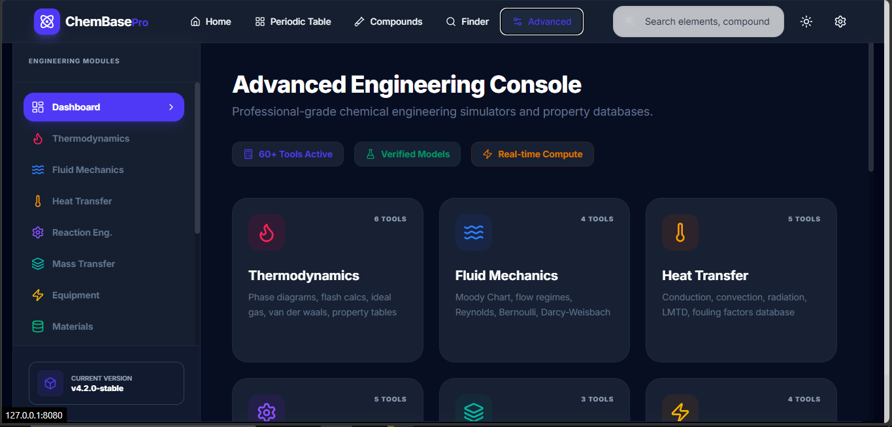
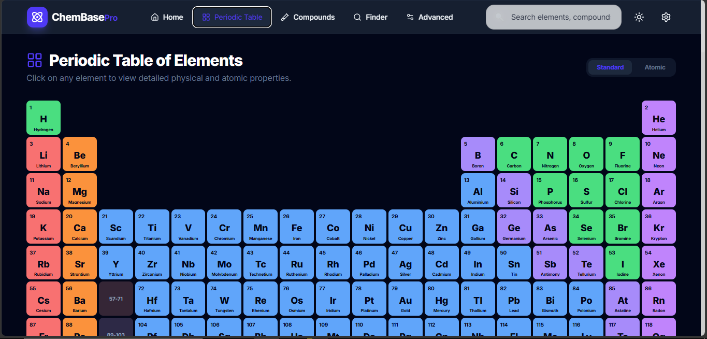
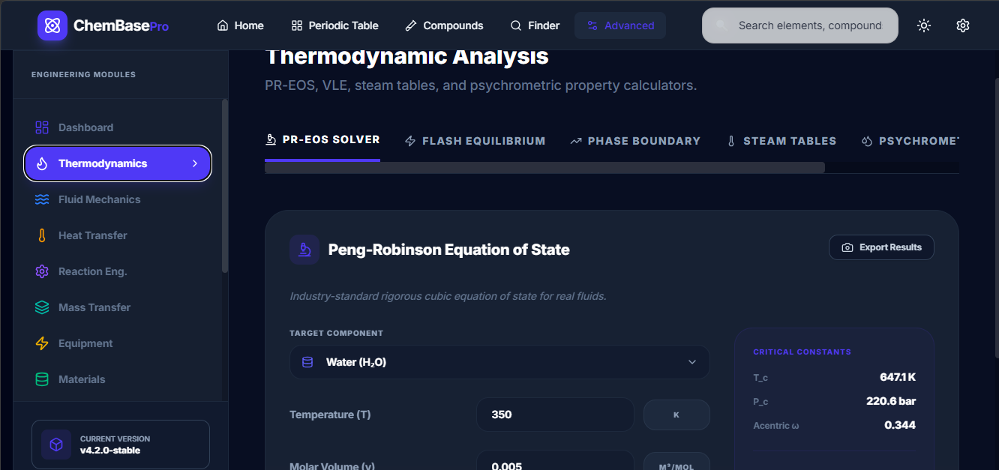
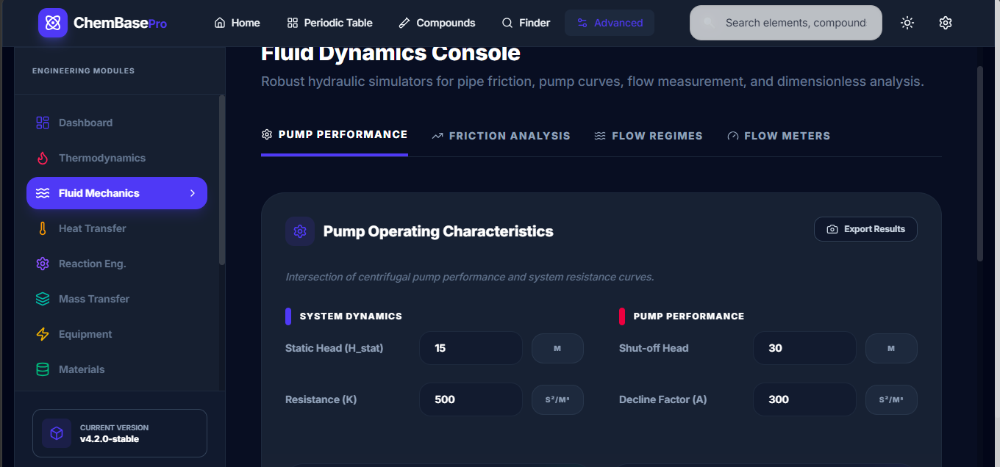
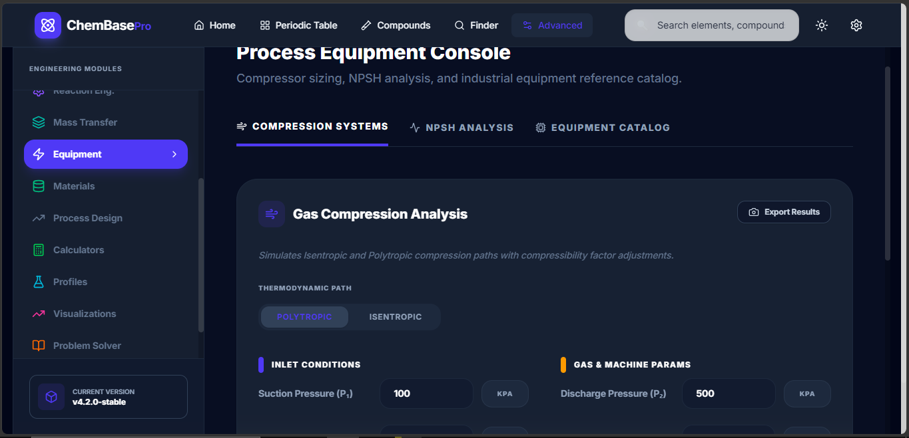
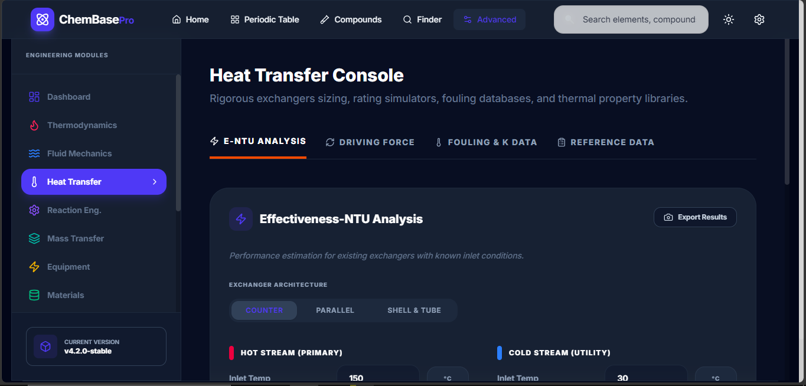
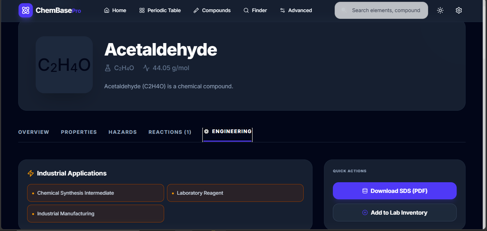
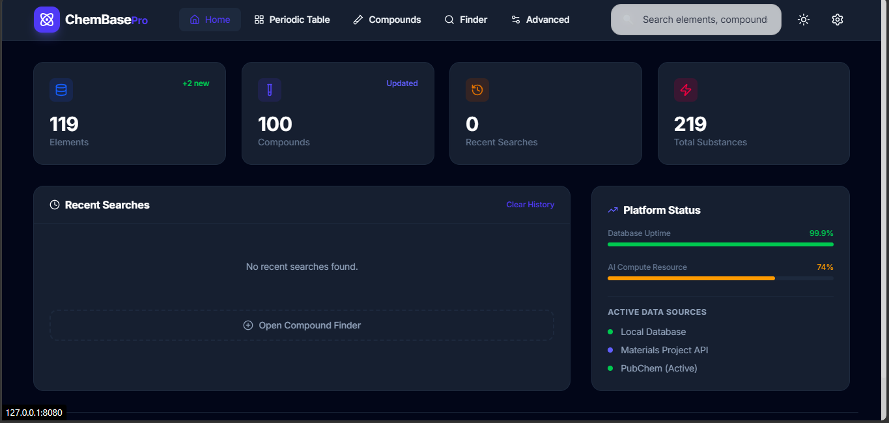

# ChemBase Pro 🧪

ChemBase Pro is a state-of-the-art chemical engineering platform and reaction database. It combines a robust SQLite-backed knowledge base with real-time AI diagnostics and professional-grade engineering simulators.

## 📸 Screenshots

### 🏠 Dashboard & Exploration
<p align="center">
  
  
</p>

### 🔬 Advanced Engineering Modules
<p align="center">
  
  
</p>

<p align="center">
  
  
</p>

### ⚙️ Search & AI Settings
<p align="center">
  
  
</p>

---

## 🛠 Modules & Features

### 1. 📋 Dashboard (Home)
The central hub of ChemBase Pro. It provides high-level statistics on the current database, recent search history, and real-time platform status (API health and database uptime).

### 2. 🧬 Interactive Periodic Table
A comprehensive element database providing:
- **Physical Properties**: Atomic mass, density, melting/boiling points.
- **Atomic Data**: Electron configuration, oxidation states, and electronegativity.
- **Visual Explorer**: Color-coded categorization (Noble gases, alkali metals, etc.).

### 3. 🧪 Compound Explorer & Finder
- **Compound Database**: Thousands of pre-seeded compounds with molar mass and state data.
- **Live PubChem Integration**: If a compound isn't in the local database, the system fetches it in real-time from PubChem.
- **Compound Finder**: Search for compounds based on constituent elements or specific physical criteria.

### 4. 🔥 Advanced Engineering Console
A suite of professional simulators for chemical processes:
- **Thermodynamics**: 
  - **Peng-Robinson EOS Solver**: High-accuracy cubic equation of state for real fluids.
  - **VLE & Flash Equilibrium**: Vapor-Liquid equilibrium calculations.
  - **Steam Tables**: Thermodynamic properties of water and steam.
- **Fluid Mechanics**:
  - **Pump Operating Characteristics**: Calculate pump performance and system resistance curves.
  - **Friction Analysis**: Moody Chart simulators for pipe friction factors.
  - **Flow Meters**: Sizing for Orifice and Venturi meters.
- **Heat Transfer**:
  - **LMTD Method**: Logarithmic Mean Temperature Difference for heat exchanger sizing.
  - **Fouling Database**: Standard fouling factors for industrial fluids.
- **Equipment Design**:
  - **Gas Compression**: Isentropic and polytropic compression path analysis.
  - **NPSH Analysis**: Net Positive Suction Head calculations for pump safety.
- **Reaction Engineering**: Batch and CSTR reactor volume sizing and residence time analysis.

### 5. 🤖 AI Pipeline (Gemini/Groq/NVIDIA)
Integrate the latest LLMs to perform chemical diagnostics:
- **Diagnostic Chatbot**: Ask complex questions about chemical hazards or reaction safety.
- **Provider Hub**: Toggle between Gemini 2.5, Llama 3.3, and DeepSeek models.
- **Key Security**: All API keys are stored in `localStorage`, keeping your secrets off the server.

---

## 🚀 Getting Started

### 1. Clone & Init
```bash
git clone https://github.com/raz786786/Chembase.git
cd Chembase
git init
```

### 2. Backend Setup
```bash
python -m venv .venv
# Activate .venv (Windows: .venv\Scripts\activate)
cd backend
pip install -r requirements.txt
```

### 3. Frontend Setup
```bash
cd frontend
npm install
```

### 4. Launch
Run **`start.bat`** from the root folder.
- Frontend: `http://127.0.0.1:8080`
- Backend: `http://127.0.0.1:9222`

---

## 📁 Folder Structure
```text
├── backend/            # FastAPI Backend
│   ├── app/           # Core Logic & API
│   └── requirements.txt
├── frontend/           # React + Vite Frontend
│   ├── src/           # Components & State
│   └── vite.config.ts
├── docs/screenshots/   # High-res screenshots
├── .gitignore          # Production-ready ignore rules
└── start.bat          # One-click start script
```

## 📄 License
MIT License - Copyright (c) 2026.
